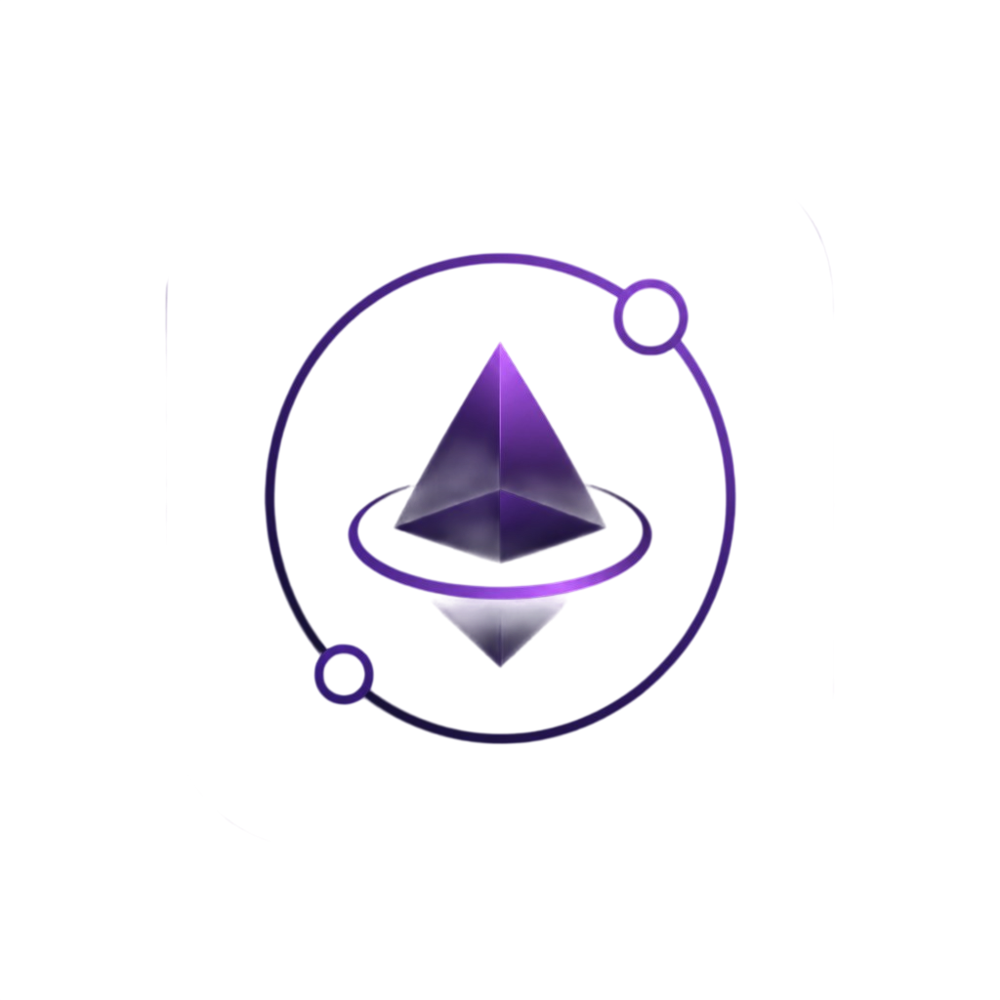

# Welcome to VoidScribe Code

<p align="center">
  
</p>

<p align="center">
  <a href="LICENSE"></a>
  
</p>

<p align="center"><strong>Free open-source desktop IDE</strong> with support for LLM API integration.</p>

> **Work in progress.** No `.exe` / `.dmg` installers yet — run from source.

[Русская версия](README.ru.md)

---

## What you get

- File explorer and multi-tab editor
- Integrated terminal
- Two window layouts: full IDE or chat-focused
- **Chat** — talk to a model (no file tools)
- **Agent** — can edit the project, run commands, use MCP tools
- AI works only after you add a provider and API key (or a local server) in **Settings → Add agent**

---

## AI providers

| Provider | Type | Notes |
|----------|------|--------|
| OpenAI | Cloud | API key |
| Anthropic | Cloud | API key |
| OpenRouter | Cloud | API key |
| Mistral | Cloud | API key |
| Groq | Cloud | API key |
| Cerebras | Cloud | API key |
| Gemini | Cloud | API key |
| GenAPI | Cloud | API key |
| OpenAI Compatible | Custom endpoint | Base URL + API key |
| Ollama | Local | Default: `http://127.0.0.1:11434/v1` |
| LM Studio | Local | Default: `http://127.0.0.1:1234/v1` |

Not every provider and model has been fully tested. If something does not work, we will fix it as the project develops.

---

## Run from source

**Requirements:** Node.js 18+, npm, Git. On macOS, `xcode-select --install` may be needed for the terminal.

```bash
git clone https://github.com/nacosof/VoidScribe-Code.git
cd VoidScribe-Code
npm install
npm run dev
```

```bash
npm run build    # typecheck + build → out/
npm run preview  # preview production build
```

---

## Documentation

- [ARCHITECTURE.md](ARCHITECTURE.md) — architecture (EN)
- [ARCHITECTURE.ru.md](ARCHITECTURE.ru.md) — архитектура (RU)

---

Issues and pull requests are welcome.
