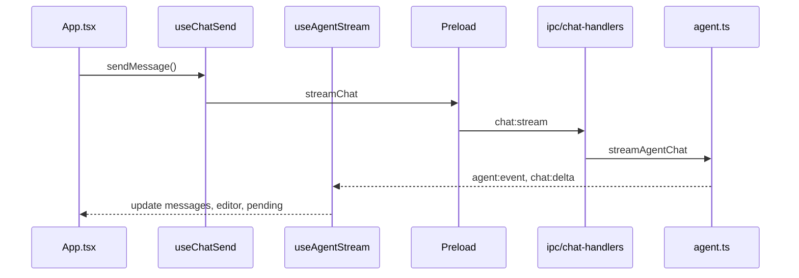

# VoidScribe Code Architecture

[Russian version](ARCHITECTURE.ru.md)

Desktop open-source IDE with AI chat and agent for local workspace development.

**Stack:** Electron · electron-vite · Vite · React · TypeScript · CodeMirror 6 · xterm.js · node-pty

---

## Repository structure

```
VoidScribe-Code/
├── docs/                            # README, architecture, license
├── electron/
│   ├── main/
│   │   ├── index.ts                 # Window, zoom, workspace watcher, IPC bootstrap
│   │   ├── ipc/                     # Domain IPC handlers
│   │   ├── agent.ts                 # streamAgentChat: normal vs agent
│   │   ├── agent-runtime/           # Scheduler, providers, transcript
│   │   ├── agent-tools/             # Tool schemas + handlers
│   │   ├── workspace.ts             # Sandbox paths, FS helpers
│   │   ├── pty-manager.ts           # node-pty + pipe fallback
│   │   └── ...
│   └── preload/
│       └── index.ts                 # contextBridge → window.voidscribe
├── src/
│   ├── App.tsx                      # IDE composition root
│   ├── features/
│   │   ├── onboarding/              # OnboardingWizard (first launch)
│   │   ├── chat/                    # useChatSend, useAgentStream, ChatComposer
│   │   ├── agent/                   # usePendingChanges
│   │   ├── settings/                # SettingsScreen + sections
│   │   └── terminal/                # TerminalPane, theme, utils
│   ├── components/                  # WorkspaceConsole, FileExplorer, editor UI
│   ├── hooks/                       # useChatSessions, useEditorTabs
│   ├── lib/                         # agent-prompt, providers, i18n, codemirror-setup
│   └── types.ts                     # VoidScribeApi — renderer ↔ main contract
```

| Layer | Responsibility |
|-------|----------------|
| `App.tsx` | Layout, hook wiring, workspace/settings state |
| `features/*` | Chat, agent, settings, terminal domain logic |
| `components/*` | Reusable UI |
| `hooks/*` | Chat sessions, editor tabs |
| `lib/*` | Non-React utilities |
| `electron/main/ipc/*` | Domain IPC handlers |
| `types.ts` | Single API contract |

Renderer is isolated: FS, shell, AI — main process only (`contextIsolation`).

---

## UI and chat modes

### Window layout (`settings.windowLayout`)

| Layout | ID | UI |
|--------|-----|-----|
| **IDE** | `editor` | Editor + sidebar + side chat |
| **Agent / vibecoding** | `agent` | Full-screen chat, minimal editor |

### Chat mode (`ChatInteractionMode`)

| Mode | ID | Behavior |
|------|-----|----------|
| **Chat** | `normal` | LLM without tools |
| **Agent** | `agent` | Tool loop with workspace (folder required) |

Logic: `src/lib/chat-modes.ts` · UI: `ChatModeSelector.tsx`

---

## Data flow



---

## First launch (onboarding)

When `onboardingCompleted === false` in electron-store, `OnboardingWizard` is shown under a minimal `TitleBar` (logo + minimize/maximize/close — no sidebar/chat/terminal/settings).

Steps:

1. **Language** — default `en`, optional `ru` → `settings.language`
2. **Theme** — `voidscribe` / `slate` / `ocean` → `settings.theme` (live preview inside onboarding container only)
3. **Project** — open folder/file, create folder/file, or skip

Behavior:

- Welcome **always starts with English**, even if store had `ru`
- Theme preview: `data-theme` on `.app-frame--onboarding`, **not** on `document`
- After finish: `applyTheme()` on root + enter IDE
- Fixed button borders (`2px`, `box-sizing: border-box`) — no layout shift on theme pick
- When previewing **slate** / **ocean**, a circle behind the logo uses the **voidscribe** container background so the icon stays readable

IPC: `onboarding:complete`, `workspace:pickParentDirectory`, `workspace:createProjectFolder`, `workspace:createProjectFile`

After welcome finishes (`onboarding:complete`), it is never shown again.

Modules: `OnboardingWizard.tsx` · `TitleBar.tsx` (`minimal`)

---

## Agent tools (`electron/main/agent-tools/`)

| Handler | Tools |
|---------|-------|
| `read.ts` | list_directory, read_file, grep, workspace_snapshot |
| `write.ts` | write_file, search_replace |
| `shell.ts` | run_command, read_lint_errors |
| `history.ts` | list/read/restore file history |
| `misc.ts` | delete_path, capture_page_preview, MCP |

---

## IPC by domain

| Module | Channels |
|--------|----------|
| `settings-handlers` | `settings:*`, `ai:*`, `chat:save`, `onboarding:*` |
| `workspace-handlers` | `workspace:*`, `shell:*`, `file:saveAs` |
| `terminal-handlers` | `terminal:*` |
| `chat-handlers` | `chat:stream`, `chat:cancel`, `agent:*`, `mcp:*` |
| `window-handlers` | `window:*` |

---

## Agent loop

```
streamAgentChat → normal (no tools) | agent (scheduler + tools, 1 tool/step)
```

Prompts: `agent-prompt.ts` → `agent-system-prompt.ts` · Reliability: `agent-reliability.ts`

---

## Build

```bash
npm run dev
npm run build
npm run preview
```

---

## Security

- `contextIsolation` — no direct Node API in renderer
- Workspace sandboxing — blocks `..` and paths outside root
- `agent-path-edit-guard` — limits agent mutations

---

*VoidScribe Code v0.1.0*
