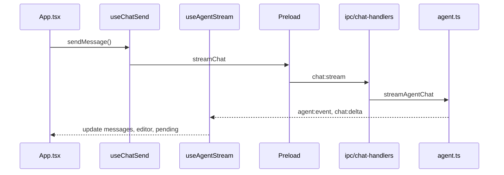

# Архитектура VoidScribe Code

[English version](ARCHITECTURE.md)

Десктопное open-source IDE с AI-чатом и агентом для работы с локальным workspace.

**Стек:** Electron · electron-vite · Vite · React · TypeScript · CodeMirror 6 · xterm.js · node-pty

---

## Структура репозитория

```
VoidScribe-Code/
├── docs/                            # README, архитектура, лицензия
├── electron/
│   ├── main/
│   │   ├── index.ts                 # Окно, zoom, workspace watcher, IPC bootstrap
│   │   ├── ipc/                     # IPC по доменам
│   │   ├── agent.ts                 # streamAgentChat: normal vs agent
│   │   ├── agent-runtime/           # Scheduler, providers, transcript
│   │   ├── agent-tools/             # Схемы и handlers инструментов
│   │   ├── workspace.ts             # Sandbox paths, FS helpers
│   │   ├── pty-manager.ts           # node-pty + pipe fallback
│   │   └── ...
│   └── preload/
│       └── index.ts                 # contextBridge → window.voidscribe
├── src/
│   ├── App.tsx                      # Composition root IDE
│   ├── features/
│   │   ├── onboarding/              # OnboardingWizard (первый запуск)
│   │   ├── chat/                    # useChatSend, useAgentStream, ChatComposer
│   │   ├── agent/                   # usePendingChanges
│   │   ├── settings/                # SettingsScreen + секции
│   │   └── terminal/                # TerminalPane, theme, utils
│   ├── components/                  # WorkspaceConsole, FileExplorer, editor UI
│   ├── hooks/                       # useChatSessions, useEditorTabs
│   ├── lib/                         # agent-prompt, providers, i18n, codemirror-setup
│   └── types.ts                     # VoidScribeApi — контракт renderer ↔ main
```

| Слой | Ответственность |
|------|-----------------|
| `App.tsx` | Layout, wiring хуков, workspace/settings state |
| `features/*` | Доменная логика чата, агента, настроек, терминала |
| `components/*` | Переиспользуемый UI |
| `hooks/*` | Сессии чата, вкладки редактора |
| `lib/*` | Утилиты без React |
| `electron/main/ipc/*` | IPC handlers по доменам |
| `types.ts` | Единый контракт API |

Renderer изолирован: FS, shell, AI — только через main process (`contextIsolation`).

---

## Режимы интерфейса и чата

### Window layout (`settings.windowLayout`)

| Layout | ID | UI |
|--------|-----|-----|
| **IDE** | `editor` | Редактор + sidebar + чат сбоку |
| **Agent / vibecoding** | `agent` | Чат на весь экран, минимум редактора |

### Chat mode (`ChatInteractionMode`)

| Режим | ID | Поведение |
|-------|-----|-----------|
| **Чат** | `normal` | LLM без инструментов |
| **Агент** | `agent` | Tool loop с workspace (нужна открытая папка) |

Логика: `src/lib/chat-modes.ts` · UI: `ChatModeSelector.tsx`

---

## Поток данных



---

## Первый запуск (onboarding)

При первом запуске (`onboardingCompleted === false` в electron-store) показывается `OnboardingWizard` под минимальным `TitleBar` (лого + свернуть/развернуть/закрыть, без sidebar/чата/терминала/настроек).

Шаги:

1. **Язык** — по умолчанию `en`, можно выбрать `ru` → `settings.language`
2. **Тема** — `voidscribe` / `slate` / `ocean` → `settings.theme` (live preview только внутри onboarding-контейнера)
3. **Проект** — открыть папку/файл, создать папку/файл, или пропустить

Поведение:

- Язык на welcome **всегда стартует с English**, даже если в store был `ru`
- Превью темы: `data-theme` на `.app-frame--onboarding`, **не** на `document`
- После finish: `applyTheme()` на корень + переход в IDE
- Рамки кнопок фиксированы (`2px`, `box-sizing: border-box`)
- При preview **slate** / **ocean** под логотипом — круг с фоном контейнера стандартной темы (`voidscribe`)

IPC: `onboarding:complete`, `workspace:pickParentDirectory`, `workspace:createProjectFolder`, `workspace:createProjectFile`

После завершения welcome (`onboarding:complete`) повторно не показывается.

Модули: `OnboardingWizard.tsx` · `TitleBar.tsx` (`minimal`)

---

## Agent tools (`electron/main/agent-tools/`)

| Handler | Инструменты |
|---------|-------------|
| `read.ts` | list_directory, read_file, grep, workspace_snapshot |
| `write.ts` | write_file, search_replace |
| `shell.ts` | run_command, read_lint_errors |
| `history.ts` | list/read/restore file history |
| `misc.ts` | delete_path, capture_page_preview, MCP |

---

## IPC по доменам

| Модуль | Каналы |
|--------|--------|
| `settings-handlers` | `settings:*`, `ai:*`, `chat:save`, `onboarding:*` |
| `workspace-handlers` | `workspace:*`, `shell:*`, `file:saveAs` |
| `terminal-handlers` | `terminal:*` |
| `chat-handlers` | `chat:stream`, `chat:cancel`, `agent:*`, `mcp:*` |
| `window-handlers` | `window:*` |

---

## Цикл агента

```
streamAgentChat → normal (без tools) | agent (scheduler + tools, 1 tool/step)
```

Промпты: `agent-prompt.ts` → `agent-system-prompt.ts` · Надёжность: `agent-reliability.ts`

---

## Сборка

```bash
npm run dev
npm run build
npm run preview
```

---

## Безопасность

- `contextIsolation` — renderer без прямого Node API
- Workspace sandboxing — блокировка `..` и путей вне корня
- `agent-path-edit-guard` — ограничение мутаций агента

---

*VoidScribe Code v0.1.0*
